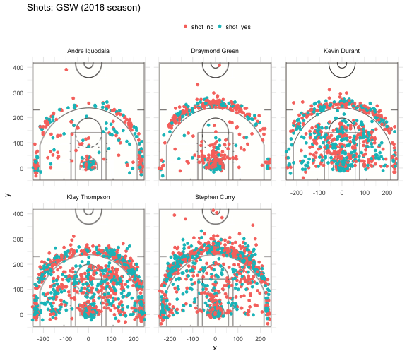

```{r, include=FALSE}
library(dplyr)
```

## Chart of Shot Attempts by Player

```{r out.width='80%', echo=FALSE, fig.align='center'}

```

## Effective Shooting Percentages by Player

```{r, echo=FALSE}
# import data
col_classes <- c("NULL", "character", "character", "integer", 
                 "integer", "real", "real", "character",
                 "character", "character", "real", "character",
                 "real", "real", "character", "real")

shots_data <- read.csv("../data/shots-data.csv",
                       colClasses = col_classes,
                       stringsAsFactors = FALSE)

# 2 PT Field Goal effective shooting percentage by player
# arranged in descending order by percentage
shots_percentage_2pt <- 
  arrange(
    summarise(
      group_by(shots_data[shots_data$shot_type == "2PT Field Goal", ], name),
      total = n(),
      made = sum(shot_made_flag == "shot_yes"),
      percentage = made / total
    ),
    desc(percentage)
  )

# 3 PT Field Goal effective shooting percentage
shots_percentage_3pt <- 
  arrange(
    summarise(
      group_by(shots_data[shots_data$shot_type == "3PT Field Goal", ], name),
      total = n(),
      made = sum(shot_made_flag == "shot_yes"),
      percentage = made / total
    ),
    desc(percentage)
  )

# Overall effective shooting percentage
shots_percentage <- 
  arrange(
    summarise(
      group_by(shots_data, name),
      total = n(),
      made = sum(shot_made_flag == "shot_yes"),
      percentage = made / total
    ),
    desc(percentage)
  )
```

### 2PT Effective Shooting %
```{r, echo=FALSE, comment = ""}
as.data.frame(shots_percentage_2pt)
```

### 3PT Effective Shooting %
```{r, echo=FALSE, comment = ""}
as.data.frame(shots_percentage_3pt)
```

### Overall
```{r, echo=FALSE, comment = ""}
as.data.frame(shots_percentage)
```

